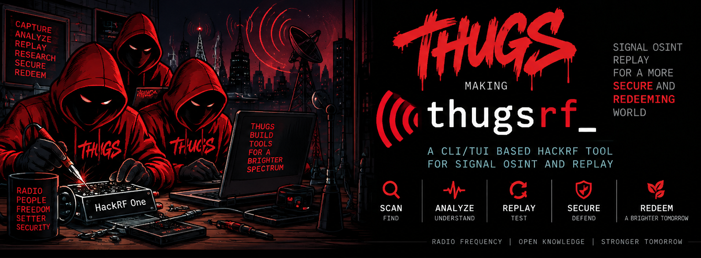
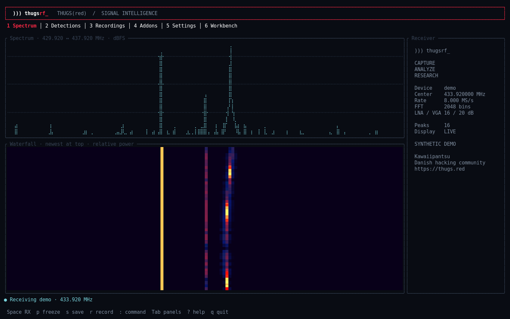
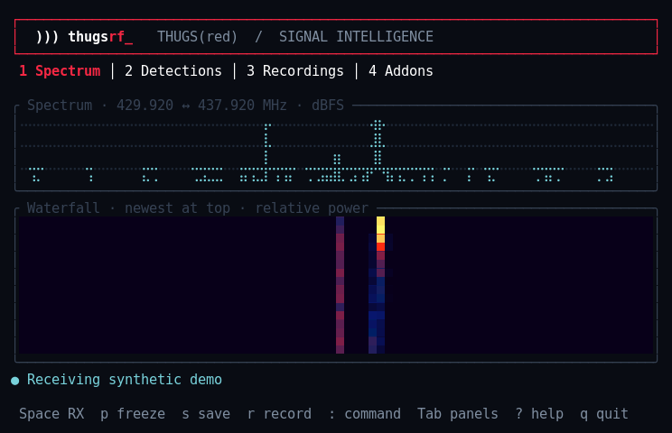
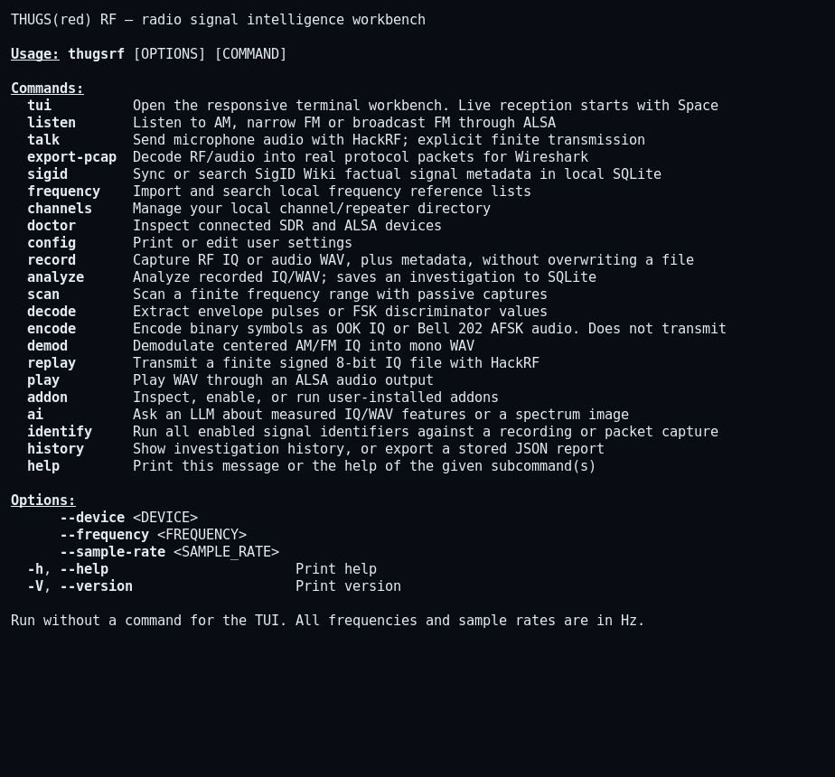
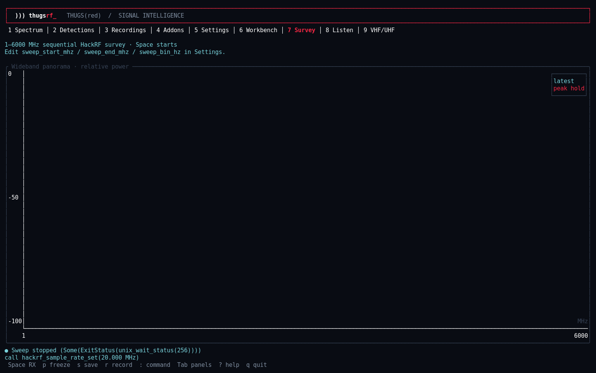
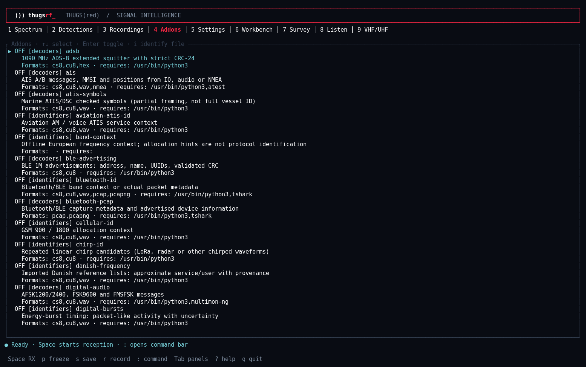
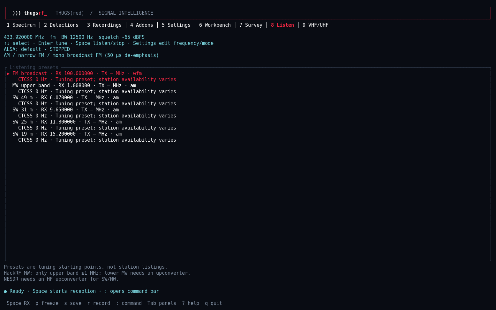
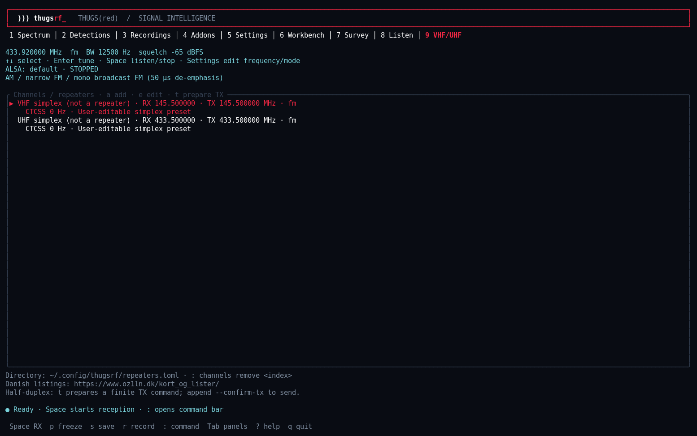

<p align="center"></p>

# THUGS(red) RF

**A native Linux signal intelligence workbench.** Capture radio signals, inspect spectra and waterfalls, extract pulse timings, run protocol decoders, and keep an investigation history from a full-color terminal.

Built by **Kawaiipantsu** from **[THUGS(red)](https://thugs.red)**, a Danish hacking community.

Rust **1.98.1**, edition 2024 · Ratatui · threaded reception and DSP · SQLite · MIT

## Build and install

```sh
make deps
make toolchain                   # official rustup installer / pinned stable compiler
make build
make check
make test
make deb                         # dist/thugsrf_0.2.0_<arch>.deb
sudo apt install ./dist/thugsrf_0.2.0_amd64.deb
thugsrf doctor
thugsrf
```

Alternatively, `sudo make install` installs under `/usr/local`. `PREFIX` and `DESTDIR` are supported. `make demo` opens a synthetic source; press **Space** to start it. `make addons` copies example addons into your user configuration without overwriting existing modules. Dependencies are locked in `Cargo.lock`.

Debian packages are built for the native architecture and target Debian 13 / Ubuntu 24.04 or later. There are no build-time SDR SDK requirements: maintained `hackrf_transfer`, `rtl_sdr`, and ALSA utilities provide the hardware transport. SQLite and TLS are compiled into the Rust application. The distribution packages install USB access rules. For non-root reception, check your distribution's HackRF/RTL-SDR udev group membership and reconnect the device after installation.

## Terminal workbench

Actual xterm screenshots of the running application. The spectrum views use the built-in **synthetic demo**, without opening a radio.

**170 × 50 — spectrum, waterfall, and receiver sidebar**

[](assets/screenshots/spectrum-wide.png)

<details>
<summary>See the compact 80 × 24 layout and CLI commands</summary>

**80 × 24 — compact spectrum and waterfall**



**Command-line interface — `thugsrf --help`**



</details>

**Wideband Survey — passive HackRF measurements across 1 MHz–6 GHz**

[](assets/screenshots/survey-wide.png)

<details>
<summary>See the addon catalog, listening presets and VHF/UHF directory</summary>







</details>

The UI fits **80 × 24**, expands with the terminal, and adds a receiver sidebar at larger widths. **170 × 50** is recommended. It uses RGB color, box drawing, a braille spectrum, and two waterfall rows per terminal cell.

| Key | Action |
| --- | --- |
| Space | Start/stop reception, sweep or listening in the selected panel |
| 7 / 8 / 9 | Wideband Survey / AM-FM Listen / VHF-UHF directory |
| l | Look up tuned frequency in local reference lists |
| Tab / Shift-Tab / 1–9 | Cycle all panels / select the first nine |
| d / D | Open shared live Decoder Console / pause or resume live addons |
| x (Decoder Console) | Clear the rolling output |
| p | Freeze display while continuing to drain the receiver |
| s (Spectrum) | Export full-resolution ASCII graph and waterfall to separate files |
| s (Decoder Console) | Toggle logging to `~/.config/thugsrf/decoder-output-<timestamp>.log` |
| s (Detections) | Save spectrum and detections to SQLite |
| r | Prepare a finite recording command |
| : | Run a CLI command in the workbench |
| ↑↓, Enter | Select/edit settings or toggle a reviewed addon |
| [ / ] / mouse wheel (Spectrum) | Zoom out/in around the selected signal; `0` restores full span |
| Left click (Spectrum/waterfall) | Select frequency and peak measurements; `t` tunes, `l` looks up references |
| m / b (Spectrum or Listen) | Cycle NFM/FM/WFM/AM presets / enter receive bandwidth |
| a (Spectrum) | Start/stop listening; spectrum is held during audio |
| f (Spectrum) | Cycle FFT resolution: 2048 / 8192 / 32768 / 65536 bins |
| c (Spectrum) | Cycle waterfall palettes |
| + / - (Spectrum) | Raise/lower waterfall threshold by 5 dB; higher hides weaker signals |
| Enter (Spectrum) | Enter frequency (e.g. `145.252MHz`); Enter tunes, Esc cancels |
| ← / → (Spectrum) | Fine tune down/up; default 500 kHz |
| ↑ / ↓ or PgUp / PgDn (Spectrum) | Coarse tune up/down; default 10 MHz |
| PgUp / PgDn (other panels) | Scroll output |
| ? / q | Help / quit |

If HackRF exits before delivering any samples with a one-second USB transfer timeout, live reception retries up to three attempts. Other errors and failures after reception starts are shown in full in the Workbench; Space retries manually.

Enable one or more decoders in Addons (4), start Spectrum reception with Space, and press `d` to watch their combined live output. The console labels each entry with decoder, frequency and capture time. `D` pauses/resumes live addon decoding. [Decoder behavior and limits](docs/PROTOCOLS.md).

The command bar supports quoted paths. Jobs execute off the UI thread and stop live reception first to release the radio. The TUI never starts RF transmission on launch. `replay` needs `--confirm-tx` on every invocation.

## Survey, listening and repeaters

**7 Survey:** sequential HackRF panorama from **1 MHz to 6 GHz**, with coverage and peak hold. The full span is swept; instantaneous capture remains at most about 20 MHz.

**8 Listen:** AM, narrow FM and mono broadcast FM audio with optional live RDS station name and RadioText, with SW and upper-MW tuning presets. **9 VHF/UHF:** editable RX/TX channel directory, CTCSS TX tones and explicitly confirmed finite microphone transmission. Start listening with Space. Saved FM IQ/MPX also supports `decode --mode rds`. [Controls and hardware limits](docs/RADIO.md).

**Frequency OSINT:** import saved Danish HTML tables or CSV lists, then press **l** to look up the current frequency. Entries retain source, region and import date. Includes official US/European source links and a small US allocation starter set. [DKScan, FCC/NTIA and EFIS workflow](docs/FREQUENCIES.md).

[Full GitHub Wiki manual](https://github.com/kawaiipantsu/thugsrf/wiki): installation, controls, configuration, investigation guides, examples, screenshots and complete command help.

## Hardware and capture

```sh
thugsrf doctor
thugsrf --frequency 433920000 record signal.cs8 --seconds 5
thugsrf analyze signal.cs8 --png spectrum.png
thugsrf --device rtl --sample-rate 2400000 record signal.cu8 --seconds 5
thugsrf --device audio record microphone.wav --seconds 5
thugsrf --device audio tui
thugsrf scan --start 433000000 --end 435000000 --step 1000000 --seconds 1
```

| Source | Input / output | Supported behavior |
| --- | --- | --- |
| HackRF One | Signed 8-bit interleaved IQ (`cs8`) | RX, finite recording, finite replay; 0–6 GHz driver tuning; 8–20 MS/s |
| Nooelec NESDR SMArTee v2 / RTL-SDR | Unsigned 8-bit interleaved IQ (`cu8`) | RX and recording; 24–1766 MHz tuning; 2.4 MS/s default; receive-only |
| ALSA sound card | S16 mono capture / WAV files | Live audio spectrum, recording, WAV playback, AFSK generation |
| Demo | Synthetic complex samples | UI exploration without hardware |

Rates are in **Hz**; the global frequency option also accepts units such as `145.252MHz`, gains in dB (the `rtl_gain` setting uses tenths of a dB). Hardware limits still depend on the tuner, USB controller and firmware. HackRF's RF amplifier remains off by default. Its 8–20 MS/s operating range follows [HackRF's sampling/filter guidance](https://hackrf.readthedocs.io/en/stable/sampling_rate.html). The NESDR SMArTee has a powered bias tee: use compatible antennas/accessories.

Recordings never silently overwrite files. RF recordings receive a SigMF-style `.sigmf-meta` sidecar; the raw recording retains your chosen filename. Audio recordings receive a `.wav.json` metadata sidecar, described in `docs/ARCHITECTURE.md`. A finite scan retains each capture and stores its report. Scan steps are center frequencies; overlapping captures are expected when the step is smaller than sample rate.

## Analyze, decode, encode, replay

```sh
thugsrf decode signal.cs8 --mode ook
thugsrf decode signal.cs8 --mode fsk
thugsrf demod signal.cs8 audio.wav --mode fm
thugsrf play audio.wav
thugsrf encode test.cs8 --mode ook --bits 10110010 --rate 8000000 --baud 1000
thugsrf encode test.wav --mode afsk --bits 10110010 --rate 48000 --baud 1200
# A deliberate finite transmission in your authorized RF test setup:
thugsrf --frequency 433920000 replay test.cs8 --confirm-tx --gain 0
thugsrf history
thugsrf history --export 1 > investigation.json
```

Built-in analysis includes Hann-window FFT, DC removal, power spectra, median noise estimates, threshold-based peaks, approximate occupied bandwidth, RMS and crest factor. Frequency hints are **context, not protocol identification**. dBFS is uncalibrated; it is not received dBm. WAV analysis downmixes channels and uses the file's sample rate. Real audio shows a mirrored two-sided spectrum.

The built-in OOK decoder extracts envelope pulse durations; the FSK decoder extracts instantaneous frequency. Neither pretends to recover synchronized protocol packets. The **rtl433 addon** runs the installed [rtl_433](https://github.com/merbanan/rtl_433) decoder against recorded IQ for supported sensor protocols. No events is a valid result. AM/FM demodulation is a basic centered-carrier implementation, with a simple audio filter and a bounded input window. OOK and AFSK encoding generates symbols, not complete protocol framing/checksums.

## Addons and signal OSINT

```sh
make addons
thugsrf addon install              # works from the installed Debian package too
thugsrf addon list
thugsrf addon enable all --kind identifiers
thugsrf identify signal.cs8
# Review addons before enabling: they execute with your user permissions.
thugsrf addon toggle rtl433
thugsrf addon run rtl433 signal.cs8
thugsrf addon toggle band-context
thugsrf addon run band-context signal.cs8
```

Addons live in `~/.config/thugsrf/decoders/<name>/` and `~/.config/thugsrf/identifiers/<name>/`. Each has an `addon.toml` manifest and an executable command. A versioned JSON request arrives on stdin; one JSON object leaves stdout. Rust, Go, Python and other languages all work. Addons have execution deadlines and a 1 MiB output limit. They are trusted local programs, **not sandboxed plugins**.

Included: **43 activatable addons**, covering protocol decoders, packet metadata, waveform candidates and sourced frequency hints. See [the capability and limitation matrix](docs/PROTOCOLS.md). These modules do not establish transmitter ownership. See [the addon guide](docs/ADDONS.md) for the contract and extension points.

## SigID Wiki and GSM security

[SigID Wiki](https://www.sigidwiki.com/wiki/Database) supplies an optional local reference catalog: **586 signal entries** imported on the development host. Run `thugsrf sigid sync` to fetch factual metadata, then rank candidates by frequency, bandwidth and modulation. Lookups work offline. [Catalog and scoring details](docs/SIGID.md).

The `gsm-security` addon inspects existing GSM signalling captures for A5/GEA cipher settings, identity requests, masked IMSI visibility and public-cell changes against a reviewed baseline. These are passive observations, not proof of an IMSI catcher or subscriber roaming state. [GSM security evidence and limitations](docs/GSM-SECURITY.md).

## Wireshark packet export

Export recovered **BLE advertising**, **AX.25 packet-radio**, or **GSM BCCH/GSMTAP** frames as PCAP with a provenance sidecar. BLE/AX.25 exports are fixture-tested in Wireshark; the GSM RF backend still needs a clean reference capture. In Recordings/Addons, press **w** to prepare an export.

```sh
thugsrf addon enable packet-radio
thugsrf export-pcap packet-radio.wav packets.pcap --protocol ax25
wireshark packets.pcap
```

[Packet formats, BLE/GSM examples and timestamp limitations](docs/PCAP.md).

## OpenAI, Anthropic and local LLMs

Set `ai_provider` (`openai`, `anthropic`, `local`) and `ai_model` in the Settings panel or configuration file. Model names are configurable because availability and capabilities vary. Local servers use an OpenAI-compatible `/v1/chat/completions` endpoint (Ollama, llama.cpp or similar); set `local_url` to its `/v1` base URL.

```sh
thugsrf config set ai_provider local
thugsrf config set ai_model YOUR_LOCAL_MODEL
thugsrf config set local_url http://127.0.0.1:11434/v1
thugsrf ai --input microphone.wav --format wav
thugsrf ai --image spectrum.png --question 'What modulation candidates fit this spectrum?'
```

Cloud credentials come from `OPENAI_API_KEY` or `ANTHROPIC_API_KEY`; authenticated local servers may use `THUGSRF_LOCAL_API_KEY`. Credentials are never written to TOML or SQLite. AI requests only occur when you invoke `ai`. WAV and IQ inputs produce measured features locally; **raw audio is not uploaded or directly listened to by the model**. PNG/JPEG graphs are sent as image inputs and require a vision-capable model. Combine `--input` and `--image` to supply measurements and a graph together.

OpenAI uses the [Responses API](https://platform.openai.com/docs/api-reference/responses/create) with `store: false`; Anthropic uses Messages; local endpoints use Chat Completions. AI conclusions are stored separately as hypotheses. TLS is required except for loopback local servers. There is no automatic web browsing or autonomous RF action.

## Configuration and data

- `~/.config/thugsrf/config.toml`: editable, validated device, DSP and provider settings.
- `~/.config/thugsrf/{decoders,identifiers}/`: user addons.
- `~/.config/thugsrf/repeaters.toml`: local channels/repeaters.
- `~/.local/share/thugsrf/frequencies.json`: imported source-labelled frequency references.
- `~/.local/share/thugsrf/references.sqlite3`: SigID Wiki metadata cache.
- `~/.local/share/thugsrf/recordings/`: TUI and scan recordings.
- `~/.local/share/thugsrf/investigations.sqlite3`: reports, decoder findings and AI hypotheses; WAL mode.

`XDG_CONFIG_HOME` and `XDG_DATA_HOME` are honored. All settings can be edited in the TUI. `thugsrf config` prints the current configuration. Use `--device rtl` or `--device audio` to apply an appropriate default rate without changing persisted settings; changing device through Settings or `config set` resets its sample rate to a suitable default. When editing TOML manually, change device and rate together.

See [architecture and limits](docs/ARCHITECTURE.md), [addon development](docs/ADDONS.md), and [verification](docs/VERIFICATION.md). This is an initial working release with explicitly bounded analysis, not a universal protocol decoder. The GitHub banner uses the top section of the supplied artwork. The four lower logo variants are available separately in [the branding assets](assets/README.md), alongside the preserved original identity sheet; the terminal adapts its red/black palette and wordmark.

Spectrum tuning steps are configurable as `fine_tune_hz` and `coarse_tune_hz` in Settings. Frequency and tuning-step edits accept `443mhz`, `145.252MHz`, `500 kHz`, or bare integer Hz; the CLI `--frequency` accepts the same notation. Keyboard tuning changes the current session; Settings saves startup defaults. Live tuning briefly restarts reception and clears the old waterfall; stopped reception stays stopped.
