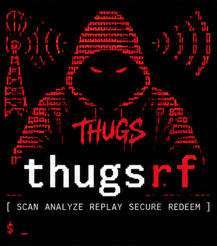
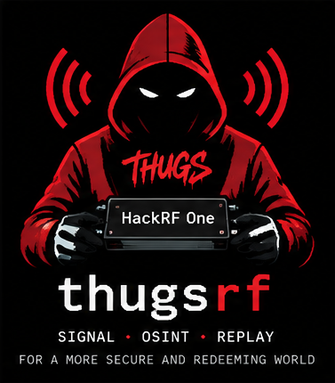
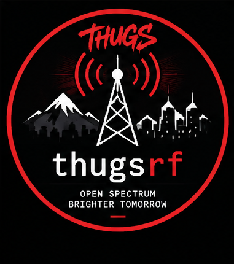
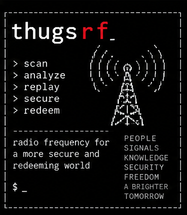

# THUGS(red) RF artwork

The supplied `identity.png` is the original design sheet. Its top section is the GitHub banner, with the illustration on the left and wordmark on the right. Its lower section contains four separate logo variants.

The README uses only the cropped banner:


| ASCII hood logo | HackRF logo | Round logo | Terminal / ASCII reference |
| --- | --- | --- | --- |
|  |  |  |  |

These are direct PNG crops, without regeneration, recoloring, or rescaling. The terminal reference remains a raster image; `logo.txt` is the separate text adaptation.

To reproduce the crops with ImageMagick:

```sh
sh scripts/crop-branding.sh
```

The original sheet is retained unchanged for future asset work.
